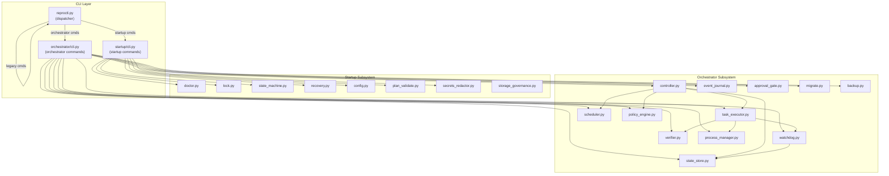

# 系统架构

## 1. 系统定位

DL Paper Reproduction (dl-paper-repro) 是一个 Cursor 插件 + CLI 系统，用于：
- 发现和评估论文候选仓库
- 分阶段验证复现可能性（L0-L3）
- 执行受控训练和评估
- 生成可审计的证据链
- 支持点云和通用深度学习论文

**版本**: 0.2.0
**插件路径**: `~/.cursor/plugins/local/dl-paper-repro`

## 2. 核心设计原则

从代码注释和实现提取的核心原则：

1. **证据驱动 (Evidence-Driven)**: 每个操作都必须生成可审计的证据
2. **Gate 门控机制**: 阶段化门控 (Gate 0-5) 确保只有通过前置检查才能继续
3. **Human-in-the-Loop**: 12 项强制人工检查点，防止静默违规
4. **原则校验 (Principles)**: 5 项最高原则 (require_official_first, require_strict_mode, require_raw_metrics, require_provenance, require_reproducibility)
5. **幂等性 (Idempotency)**: 重复操作不会产生副作用
6. **原子性 (Atomicity)**: 状态转换使用 SQLite IMMEDIATE 事务
7. **非覆盖原则**: 失败运行必须保留，不得删除

## 3. 插件层

从 `.cursor-plugin/plugin.json` 提取：

```json
{
  "name": "dl-paper-repro",
  "displayName": "Deep Learning Paper Reproduction",
  "version": "0.2.0",
  "description": "Evidence-driven reproduction, auditing and hardware optimization...",
  "category": "developer-tools",
  "skills": "./skills/",
  "rules": "./rules/",
  "agents": "./agents/",
  "commands": "./commands/"
}
```

## 4. CLI 层架构

`reproctl.py` 是唯一入口点，采用三层分发架构：

```
reproctl.py (主分发器)
├── Orchestrator 分发 (优先)
│   └── scripts/orchestrator/cli.py
├── Startup 分发 (次优先)
│   └── scripts/startup/cli.py
└── Legacy 命令 (fallback)
    └── reproctl.py 内置命令
```

### 4.1 Orchestrator 命令

通过 `reproctl orchestrator <cmd>` 调用：

| 命令 | 功能 | 状态文件 |
|------|------|---------|
| `run` | 启动持久化控制器循环 | `.repro/execution/state.sqlite3` |
| `pause` | 暂停 orchestrator | 同上 |
| `continue` | 继续 orchestrator | 同上 |
| `stop` | 停止 orchestrator | 同上 |
| `status` | 显示状态摘要 | 同上 |
| `events` | 事件日志流 | 同上 |
| `next` | 显示下一个任务 | 同上 |
| `approve` | 批准待审批任务 | 同上 |
| `reject` | 拒绝待审批任务 | 同上 |
| `daemon` | 后台守护进程控制 | `.repro/execution/controller.pid` |
| `migrate` | 状态迁移 | 同上 |
| `backup` | 创建备份快照 | 备份目录 |
| `restore` | 从备份恢复 | 备份目录 |
| `integrity-check` | 完整性检查 | 同上 |
| `rollback-version` | 回滚版本 | 同上 |

### 4.2 Startup 命令

通过 `reproctl <cmd>` 调用：

| 命令 | 功能 | 退出码 |
|------|------|--------|
| `start` | 引导和启动项目 | 0/2/3/4/5/8 |
| `doctor` | 预检（无状态变更） | 0/3 |
| `status` | 显示项目状态 | 0/2 |
| `resume` | 恢复中断项目 | 0/2/4/8 |
| `stop` | 优雅停止并清除锁 | 0/2 |
| `verify` | 验证启动证据链 | 0/8 |
| `version` | 打印版本信息 | 0 |

### 4.3 Legacy 命令

通过 `reproctl.py <cmd>` 调用（向后兼容）：

| 命令 | 功能 |
|------|------|
| `init` | 初始化新项目 |
| `can-launch` | 检查能否启动训练 |
| `launch` | 启动完整训练 |
| `run-short-loop` | 运行短循环验证测试 |
| `verify` | 从检查点验证指标 |
| `report` | 生成报告 |
| `update-gate` | 手动更新门状态 |
| `record-experiment` | 追加实验行 |
| `update-experiment` | 更新实验行 |
| `get-experiments` | 查询实验 |
| `human-checkpoint` | 强制 12 项人工检查 |
| `check-principles` | 校验 5 项最高原则 |
| `integrity-check` | 验证 schema 和核心工件完整性 |

## 5. 执行控制层

### 5.1 StateStore (SQLite + WAL)

**数据库路径**: `.repro/execution/state.sqlite3`

**数据库表结构**:

```
metadata: key-value 版本信息
├── control_state: RUNNING/PAUSED/STOPPED
├── plan_id, plan_path, mode, automation
└── mandatory_task_ids, budgets

tasks: 任务状态机
├── id, name, gate, status
├── deps_json, command, timeout_min
├── acceptance_json, retry_json
└── attempts, pid, log_path, started_at, finished_at

approvals: 人工审批
├── approval_id, task_id, status
├── reason, created_at, expires_at
└── decided_at

events: 事件日志
├── seq (自增), timestamp, event_type
├── task_id, payload_json

heartbeats: 进程心跳
├── owner, pid, timestamp
└── detail_json
```

### 5.2 Task 状态机

```
PENDING → READY → RUNNING → VERIFYING → PASS
                     ↓         ↓
                   FAIL ←←←←←←←
                     ↓
                RETRY_WAIT → READY

READY → WAITING_APPROVAL → APPROVED → RUNNING
                          ↘ REJECTED
```

**状态转换规则**:
- PENDING: {READY, FAIL}
- READY: {RUNNING, WAITING_APPROVAL, REJECTED, FAIL}
- RUNNING: {VERIFYING, FAIL, READY}
- VERIFYING: {PASS, FAIL}
- FAIL: {RETRY_WAIT}
- RETRY_WAIT: {READY}
- WAITING_APPROVAL: {APPROVED, REJECTED}
- APPROVED: {RUNNING}
- PASS: (终态)
- REJECTED: (终态)

### 5.3 Control States

- **RUNNING**: 正常执行
- **PAUSED**: 暂停（可通过 `continue` 恢复）
- **STOPPED**: 停止（不可恢复）

## 6. 模块依赖图



## 7. 执行布局

```
project/
├── .repro/
│   ├── config.yaml           # 用户配置
│   ├── repro.yaml            # 项目配置
│   ├── run.lock              # PID 文件锁
│   ├── repro_audit/
│   │   ├── STATE.json        # 状态
│   │   └── DECISION_LOG.md   # 决策日志
│   ├── startup/
│   │   ├── startup.log
│   │   ├── startup_state.json
│   │   └── doctor_report.json
│   └── execution/
│       ├── execution_state.json
│       ├── state.sqlite3      # SQLite WAL
│       ├── controller.pid
│       ├── controller.heartbeat
│       ├── daemon.log
│       └── checkpoints/
├── primary/                  # 主要仓库
├── reference/                # 参考仓库
├── experiments/             # 实验跟踪
│   └── experiment_tracker.csv
└── output/                   # 输出文件
```

## 8. 退出码定义

| 退出码 | 含义 | 来源 |
|--------|------|------|
| 0 | 成功 | 通用 |
| 1 | 失败/参数错误 | 通用 |
| 2 | 配置错误 | startup/cli.py |
| 3 | Doctor 失败（必需项） | startup/cli.py |
| 4 | 已有实例运行 | startup/cli.py |
| 5 | 无效计划 | startup/cli.py |
| 6 | 任务失败 | startup/cli.py |
| 7 | 任务阻塞 | orchestrator/cli.py |
| 8 | 恢复失败 | startup/cli.py |
| 9 | 安全阻塞 | startup/cli.py |
| 10 | 内部错误 | 通用 |
| 11 | (未使用) | - |
| 12 | (未使用) | - |

## 9. 门控系统 (Gates)

| Gate | 名称 | 描述 |
|------|------|------|
| gate_0_paper_audit | 论文审计 | 验证论文数据 |
| gate_1_preflight | 预检 | 环境验证 |
| gate_2_short_loop | 短循环 | L0-L3 测试 |
| gate_3_parity | 奇偶校验 | 优化模式验证 |
| gate_4_full_training | 完整训练 | 正式训练 |
| gate_5_evidence | 证据 | 最终验证 |

### 短循环测试 (Gate 2)

| Level | 测试 | 描述 |
|-------|------|------|
| L0 | Smoke Test | 单批次前向+反向传播 |
| L1 | Overfit Test | 单批次过拟合测试 |
| L2 | Mini-Loop Test | 端到端小数据集循环 |
| L3 | Checkpoint Resume Test | 检查点保存/加载验证 |

## 10. Doctor 检查项

| 检查 | 状态枚举 | 描述 |
|------|----------|------|
| plugin_manifest | PASS/FAIL | plugin.json 存在且有效 |
| python | PASS | Python 版本检查 |
| deps | PASS/WARNING | 依赖检查 |
| config_format | PASS/WARNING/FAIL | 配置文件格式 |
| git | PASS/WARNING/FAIL | Git 仓库状态 |
| plan_exists | PASS/WARNING/FAIL | 计划文件存在 |
| task_graph | PASS/WARNING/FAIL | 任务图依赖验证 |
| disk_space | PASS/WARNING/FAIL | 磁盘空间检查 |
| rw | PASS/FAIL | 读写权限 |
| gpu | PASS/WARNING | GPU 可用性 |
| cuda_match | PASS/WARNING/FAIL | CUDA 版本匹配 |
| driver | PASS/WARNING | NVIDIA 驱动 |
| torch | PASS/WARNING | PyTorch 安装 |
| security | PASS/WARNING | 凭证扫描 |
| leftover_procs | PASS/WARNING | 残留进程检查 |
| state_file | PASS/WARNING | 状态文件完整性 |
| checkpoint | PASS/WARNING | 检查点完整性 |
