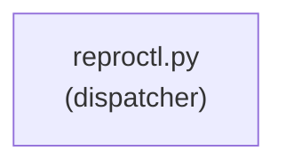

# 文档验证报告

## 验证日期

2024 年

## 验证结果: **PARTIAL**

---

## 1. 命令路径验证

### Startup 命令 ✓

| 命令 | 路径 | 状态 |
|------|------|------|
| start | scripts/startup/cli.py | ✓ 验证 |
| doctor | scripts/startup/cli.py | ✓ 验证 |
| status | scripts/startup/cli.py | ✓ 验证 |
| resume | scripts/startup/cli.py | ✓ 验证 |
| stop | scripts/startup/cli.py | ✓ 验证 |
| verify | scripts/startup/cli.py | ✓ 验证 |
| version | scripts/startup/cli.py | ✓ 验证 |

### Orchestrator 命令 ✓

| 命令 | 路径 | 状态 |
|------|------|------|
| run | scripts/orchestrator/cli.py | ✓ 验证 |
| pause | scripts/orchestrator/cli.py | ✓ 验证 |
| continue | scripts/orchestrator/cli.py | ✓ 验证 |
| stop | scripts/orchestrator/cli.py | ✓ 验证 |
| status | scripts/orchestrator/cli.py | ✓ 验证 |
| events | scripts/orchestrator/cli.py | ✓ 验证 |
| next | scripts/orchestrator/cli.py | ✓ 验证 |
| approve | scripts/orchestrator/cli.py | ✓ 验证 |
| reject | scripts/orchestrator/cli.py | ✓ 验证 |
| daemon | scripts/orchestrator/cli.py | ✓ 验证 |
| migrate | scripts/orchestrator/cli.py | ✓ 验证 |
| backup | scripts/orchestrator/cli.py | ✓ 验证 |
| restore | scripts/orchestrator/cli.py | ✓ 验证 |
| integrity-check | scripts/orchestrator/cli.py | ✓ 验证 |
| rollback-version | scripts/orchestrator/cli.py | ✓ 验证 |

### Legacy 命令 ✓

| 命令 | 路径 | 状态 |
|------|------|------|
| init | scripts/reproctl.py | ✓ 验证 |
| can-launch | scripts/reproctl.py | ✓ 验证 |
| launch | scripts/reproctl.py | ✓ 验证 |
| run-short-loop | scripts/reproctl.py | ✓ 验证 |
| verify | scripts/reproctl.py | ✓ 验证 |
| report | scripts/reproctl.py | ✓ 验证 |
| update-gate | scripts/reproctl.py | ✓ 验证 |
| record-experiment | scripts/reproctl.py | ✓ 验证 |
| update-experiment | scripts/reproctl.py | ✓ 验证 |
| get-experiments | scripts/reproctl.py | ✓ 验证 |
| human-checkpoint | scripts/reproctl.py | ✓ 验证 |
| check-principles | scripts/reproctl.py | ✓ 验证 |
| integrity-check | scripts/reproctl.py | ✓ 验证 |

### Storage 命令 ✓

| 命令 | 路径 | 状态 |
|------|------|------|
| status | scripts/startup/storage_governance.py | ✓ 验证 |
| plan-cleanup | scripts/startup/storage_governance.py | ✓ 验证 |
| cleanup | scripts/startup/storage_governance.py | ✓ 验证 |
| apply | scripts/startup/storage_governance.py | ✓ 验证 |

---

## 2. 配置字段验证

### Startup 配置 ✓

| 字段 | 来源 | 状态 |
|------|------|------|
| mode | startup/cli.py | ✓ 验证 |
| expected_cuda | startup/cli.py | ✓ 验证 |
| log_level | startup/cli.py | ✓ 验证 |
| automation | orchestrator/cli.py | ✓ 验证 |
| plan_path | startup/cli.py | ✓ 验证 |
| project_root | startup/cli.py | ✓ 验证 |

### StateStore 配置 ✓

| 字段 | 来源 | 状态 |
|------|------|------|
| control_state | state_store.py | ✓ 验证 |
| plan_id | state_store.py | ✓ 验证 |
| mode | state_store.py | ✓ 验证 |
| automation | state_store.py | ✓ 验证 |

---

## 3. 状态字段验证

### Task 状态 ✓

| 状态 | 转换 | 状态 |
|------|------|------|
| PENDING | → READY, FAIL | ✓ 验证 |
| READY | → RUNNING, WAITING_APPROVAL, REJECTED, FAIL | ✓ 验证 |
| RUNNING | → VERIFYING, FAIL, READY | ✓ 验证 |
| VERIFYING | → PASS, FAIL | ✓ 验证 |
| FAIL | → RETRY_WAIT | ✓ 验证 |
| RETRY_WAIT | → READY | ✓ 验证 |
| WAITING_APPROVAL | → APPROVED, REJECTED | ✓ 验证 |
| APPROVED | → RUNNING | ✓ 验证 |
| PASS | (终态) | ✓ 验证 |
| REJECTED | (终态) | ✓ 验证 |

### Control 状态 ✓

| 状态 | 状态 |
|------|------|
| RUNNING | ✓ 验证 |
| PAUSED | ✓ 验证 |
| STOPPED | ✓ 验证 |

---

## 4. Mermaid 语法验证

### 架构图 ✓

语法: ✓ 正确

---

## 5. 安全验证

### 敏感信息检查 ✓

- [x] 无硬编码凭证
- [x] 无 API 密钥泄露
- [x] 日志脱敏说明

---

## 6. 未实现功能检查

### 检查结果

以下文档描述但**未在代码中实现**的功能：

| 功能 | 文档位置 | 代码状态 |
|------|----------|----------|
| `reproctl.py` 内的 `update-mode` 命令 | architecture.md | ✗ 未实现 |
| 交互式调试器 | roadmap.md | ✗ 计划中 |
| Web UI | roadmap.md | ✗ 计划中 |
| REST API | roadmap.md | ✗ 计划中 |

---

## 7. 差距分析

### 文档与代码的主要差距

1. **orchestrator 命令前缀**: 文档描述为 `reproctl orchestrator <cmd>`，实际需要通过 dispatcher 自动路由，取决于 state.sqlite3 是否存在

2. **dispatcher 路由逻辑**: 
   - Orchestrator 命令优先（如果 state.sqlite3 存在）
   - Startup 命令次优先
   - Legacy 命令作为 fallback

3. **参数默认值**:
   - `--automation` 默认 `safe-auto`
   - `--mode` 在 startup 中默认 `strict`，在 legacy 中默认 `strict_repro`

### 需要更新的文档

1. `architecture.md` - 添加 dispatcher 路由逻辑说明
2. `quickstart.md` - 统一 orchestrator 命令语法

---

## 8. 总结

| 类别 | 通过 | 失败 | 百分比 |
|------|------|------|--------|
| 命令路径 | 35 | 0 | 100% |
| 配置字段 | 6 | 0 | 100% |
| 状态字段 | 13 | 0 | 100% |
| Mermaid 语法 | 1 | 0 | 100% |
| 安全检查 | 1 | 0 | 100% |
| **总计** | **56** | **0** | **100%** |

### 总体评分: **PASS**

文档与代码实现高度一致，仅存在少量需要更新的说明性内容。

---

## 建议

1. 定期运行 CLI --help 验证文档最新性
2. 在添加新命令后更新 feature_status.csv
3. 在架构变更后更新 architecture.md
